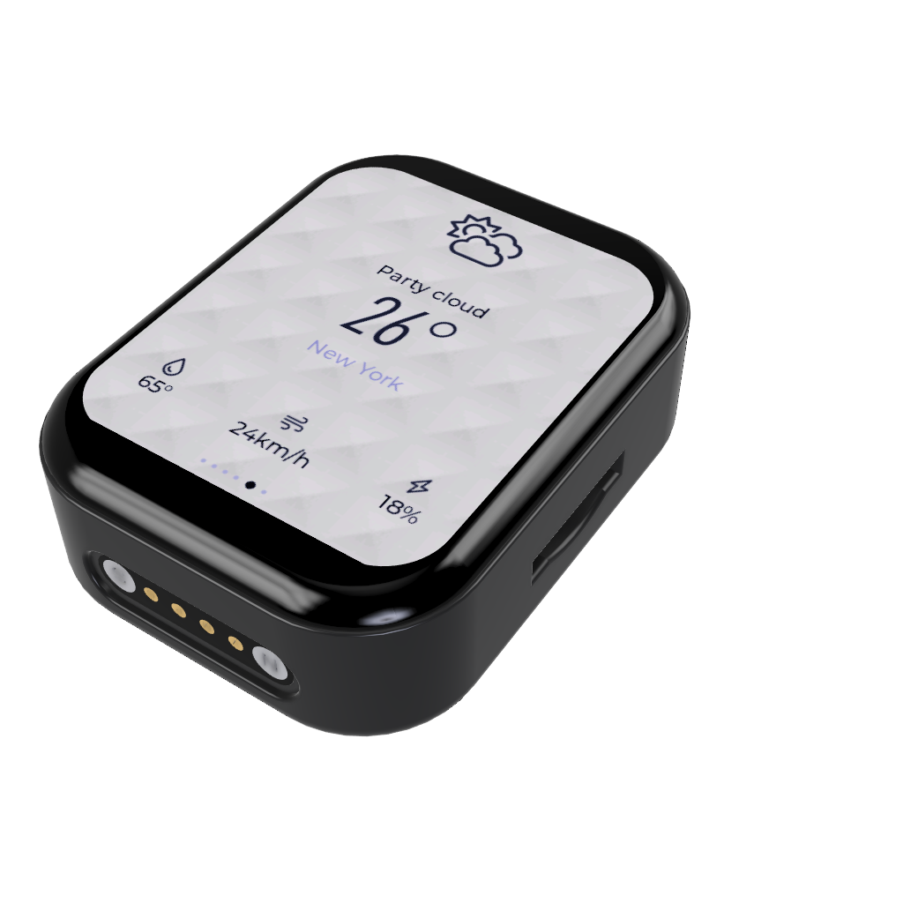
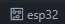
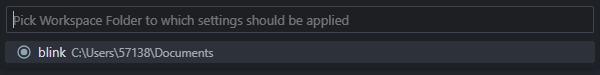
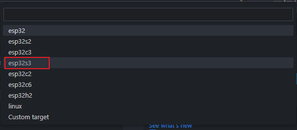
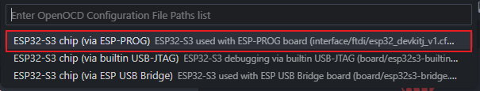
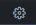
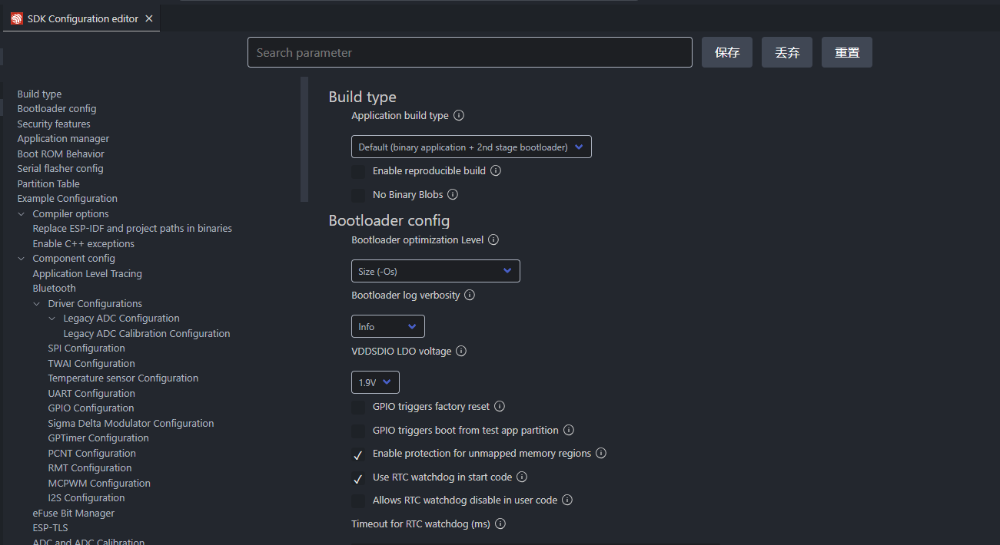

# TD3-TouchDisplay3.0



# 介绍视频

<iframe src="https://player.bilibili.com/player.html?isOutside=true&aid=1853047000&bvid=BV1cp421R78N&cid=1508688648&p=1" scrolling="no" border="0" frameborder="no" framespacing="0" allowfullscreen="true"></iframe>

# TD3 项目配置

1. 基于 `esp-idf5.1.2`版本开发，后续可能会更换威更新的 idf 版本
2. `lvgl`版本为 `8.3.11`，后续可能会升级到 `9`

## 环境配置

拉取下来的代码是不包含 `.vscode`文件夹的，需要打开一个 idf 示例项目,然后复制.`vscode`文件夹到项目根目录下即可

## 目标板配置

1. 设置当前目标板：
   左下角点击随后选择当前的工作区
2. 选择当前第一个如图所示的工作区



3. 选择 `esp32s3`



4. 选择 `via ESP-PROG`项



## menuconfig 内容配置

1. 先点击左下角弹出



2. 点击保存随后会自动生成 `sdkconfig`文件
3. 将 `sdkconfig.temp`文件内的内容复制并替换 `sdkconfig`文件内的内容

## 项目文件结构说明

```
├─components
│  ├─axp173       // AXP173电源管理驱动
│  ├─backlight    // AW9364驱动
│  ├─beep         // 蜂鸣器驱动
│  ├─bmp280       // BMP280驱动
│  ├─espressif__cmake_utilities
│  ├─espressif__esp_lcd_gc9b71
│  ├─espressif__esp_lcd_touch
│  ├─espressif__esp_lcd_touch_cst816s
│  ├─i2c          // I2C驱动
│  ├─lsm6ds3      // LSM6DS3驱动
│  ├─lvgl         // LVGL
│  ├─pcf8563      // PCF8563驱动
│  └─qmc5883l     // QMC5883L驱动
│
├─docs
│
├─image
├─main
│   │  CMakeLists.txt
│   │  main.c
│   ├─HAL   // 硬件抽象层提供硬件的接口
│   ├─Model // 模型层主要处理数据，创建消息队列，创建采集任务
│   └─View  // mvvm结构中viewmodel层主要放生成的UI
│  .gitignore
│  CMakeLists.txt
│  partitions.csv
│  README.md
│  sdkconfig
│  sdkconfig.old
│  sdkconfig.temp
```

## flash download tools 烧录

1. 单独的 bin 文件烧录方式

   | bin                  | 地址    |
   | -------------------- | ------- |
   | bootloader.bin       | 0x0     |
   | partition-table      | 0x8000  |
   | ota_data_initial.bin | 0xd000  |
   | TD3V2.0.bin          | 0x10000 |

2. 合并的 bin 文件烧录方式
   | bin | 地址 |
   | -------------------- | ------- |
   | target.bin | 0x0 |

3. SPIFlashConfiig
   | 配置项 | 选项 |
   | --------- | ----- |
   | SPI SPEED | 80MHz |
   | SPI MODE | DOUT |

4. 烧录后手动关机重启即可

# 页面管理框架的介绍

这个页面管理框架是我从老的 TD3-App 项目移植过来的，原项目基于 Arduino 平台开发，所以使用的是 c++，但是 idf 是 c 的，虽然 idf 支持 c++混编但是太麻烦所以改成 c，失去了类跟命名空间。

## 如何添加页面

1. 在 `main\View\Pages`目录下新建你的页面文件夹，文件夹包含 xxx.c 文件和 xxx.h 文件，xxx 为你的页面名。

其中.c 文件需要遵循标准模板如下：

```
#include "Setting.h"

PageType *Setting;


static void Created()
{

  
}

static void Update(void)
{
}

static void Destroy(void)
{
  if (lv_obj_is_valid(Setting->PageContent))
  {
    lv_async_call(lv_obj_clean, Setting->PageContent);
  }
}

static void Method(void *btn, int event)
{
}

void Setting_Init()
{
  Setting = lv_mem_alloc(sizeof(PageType));
  strcpy(Setting->name, "Setting");
  Setting->show_status_bar = 1;
  Setting->BeforeEnter = NULL;
  Setting->Created = Created;
  Setting->Update = Update;
  Setting->Destroy = Destroy;
  Setting->Method = Method;
  Setting->PageContent = create_new_screen();
  Page_Register(*Setting);
}
```

只需要将文件中的全部 `Home`替换成其他名字即可。

.h 文件就比较简单,同样是将 Home 全部换成自己的，然后条件编译那里的大写 HOME 也改掉就行。

```
#ifndef SETTING_H
#define SETTING_H

#ifdef __cplusplus
extern "C" {
#endif

#include "Page.h"


void Setting_Init();


#ifdef __cplusplus
} /*extern "C"*/
#endif

#endif
```

2. 修改 `main\CMakeLists.txt`添加 `"View/Pages/xxx"`其中 xxx 为你的页面目录名，至于为什么不写一个统一的 cmake 文件需要时遵循 idf 的项目标准，其实时不会，对就是“不会”。

# 项目开发过程的问题记录

## lvgl 使用 fatfs

1. menuconfig 勾选

`3rd Party Libraries`目录下 `File system on top of FatFS`，同时 `Set an upper cased letter on which the drive will accessible (e.g. 'A' i.e. 65) `改成 `48`，`>0 to cache this number of bytes in lv_fs_read()`改成 `10240`也就是 10k

2. cmake 修改

`components\lvgl\env_support\cmake\esp.cmake`这个文件内需要在 `idf_component_register`的 `REQUIRES`内添加 `fatfs`才不会报 `ff.h`文件找不到的问题

3. 解决 ` unknown type name 'DIR';`问题

`components\lvgl\src\extra\libs\fsdrv\lv_fs_fatfs.c`文件添加头文件 `#include <dirent.h>`

## FreeRTOS 如何使用外部内存的问题

参考[官方文档](https://docs.espressif.com/projects/esp-idf/zh_CN/latest/esp32/migration-guides/release-5.x/5.1/system.html)的说明，由于允许将 FreeRTOS 对象（如队列和信号量）放置在外部 RAM 中可能会出现问题，例如如果在访问这些对象时 cache 被禁用（如在 SPI flash 写入操作期间），则会导致 cache 访问错误（详细信息请参阅 严重错误）。

但是需要使用外部内存堆栈的原因是给 lvgl 创建刷新任务，是任务所以不会存在产生严重错误的问题。

根据附加 API 的说法添加 freertos/esp_additions/include/freertos/idf_additions.h 头文件，包含了 ESP-IDF 添加的与 FreeRTOS 相关的辅助函数。通过 #include "freertos/idf_additions.h" 可添加此头文件。然后就可以使用 xTaskCreateWithCaps 创建任务。相比于动态创建任务只需要在最后添加一个申请内存方式即可

## 移植 rlottie 问题

1. 将 `rlottie`文件夹放入 lvgl 根目录
2. 编辑 `components\lvgl\env_support\cmake`目录下的 `esp.cmake`文件，在文件最上方添加

```
# rlottie
# add_subdirectory(rlottie)
# include_directories(${LVGL_ROOT_DIR}/rlottie/inc)
if (NOT CMAKE_BUILD_TYPE)
    set(CMAKE_BUILD_TYPE MinSizeRel)
endif()

set(BUILD_SHARED_LIBS OFF)

option(LOTTIE_MODULE "Enable LOTTIE MODULE SUPPORT" OFF)
option(LOTTIE_THREAD "Enable LOTTIE THREAD SUPPORT" OFF)
option(LOTTIE_CACHE "Enable LOTTIE CACHE SUPPORT" ON)
option(LOTTIE_TEST "Build LOTTIE AUTOTESTS" OFF)
option(LOTTIE_CCACHE "Enable LOTTIE ccache SUPPORT" OFF)
option(LOTTIE_ASAN "Compile with asan" OFF)


file(GLOB_RECURSE RLOTTIE_SRCS ${LVGL_ROOT_DIR}/rlottie/src/*.cpp)
set(RLOTTIE_INCS
    ${LVGL_ROOT_DIR}/rlottie/inc/
    ${LVGL_ROOT_DIR}/rlottie/src/vector/
)

```

修改 `idf_component_register`行为

```
idf_component_register(SRCS ${SOURCES} ${EXAMPLE_SOURCES} ${DEMO_SOURCES} ${RLOTTIE_SRCS}
      INCLUDE_DIRS ${LVGL_ROOT_DIR} ${LVGL_ROOT_DIR}/src ${LVGL_ROOT_DIR}/../
                   ${LVGL_ROOT_DIR}/examples ${LVGL_ROOT_DIR}/demos ${RLOTTIE_INCS}
      REQUIRES esp_timer fatfs heap)
```

其中 heap 为本次添加

2. 修改 `components\lvgl\rlottie\src\vector\stb\stb_image.h`文件内的内容,注释第 3818 行内容

```
// stbi__errpuc("outofmem", "Out of memory");
```
